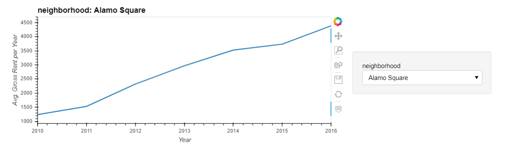

# Pythonic Monopoly

## Background

Harold's company has just started a new Real Estate Investment division to provide customers with a broader range of portfolio options. Harold was tasked with building a prototype dashboard and he needs your help. The real estate team wants to trial this initial offering with investment opportunities for the San Francisco market. If the new service is popular, then they can start to expand to other markets.

The goal of this dashboard is to provide charts, maps, and interactive visualizations that help customers explore the data and determine if they want to invest in rental properties in San Francisco.

In this homework assignment, you will help Harold accomplish the following tasks:

1. [Complete a notebook of rental analysis](#Rental-Analysis).

2. [Create a dashboard of interactive visualizations to explore the market data](#Dashboard).

---

### Rental Analysis

#### Housing Units Per Year

Default Bar Chart

  

Bar Chart with y-axis limits adjusted

  

#### Average Housing Costs in San Francisco Per Year

Vsualize the average (mean) gross rent and average price per square foot per year and visualize it as a bar chart.

The mean `gross_rent` and `sale_price_sqr_foot` for each year.
Visualize the mean `gross_rent` and `sale_price_sqr_foot` for each year as two line charts.

  

  

#### Average Prices By Neighborhood

The first visualization is a line plot showing the trend of average price per square foot over time for each neighborhood.  
The second is a line plot showing the trend of average montly rent over time for each neighborhood.

  
  
  

#### Top 10 Most Expensive Neighborhoods

The figure shows which neighborhoods are the most expensive. 

  

#### Comparing Cost to Purchase Versus Rental Income

Interactive visualization with a dropdown selector for the neighborhood. This visualization feature a side-by-side comparison of average price per square foot versus average monthly rent by year.

#### Neighborhood Map

Use a scatter mapbox object from plotly express.

  

####  Cost Analysis - Optional Challenge

Using the provided DataFrame to create the following visualizations:

Parallel Coordinates Plot.

  

Parallel Categories Plot.

  

Sunburst plot to show the most expensive neighborhoods in San Francisco per year.

   
 
---

### Dashboard

Sample Dashboard:

  

---

